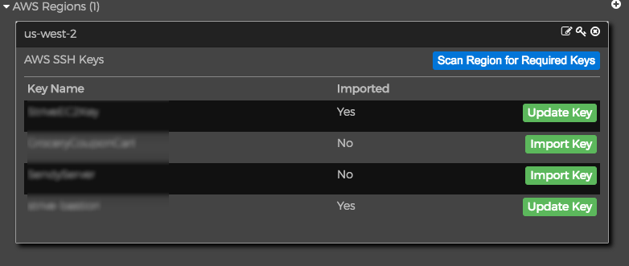
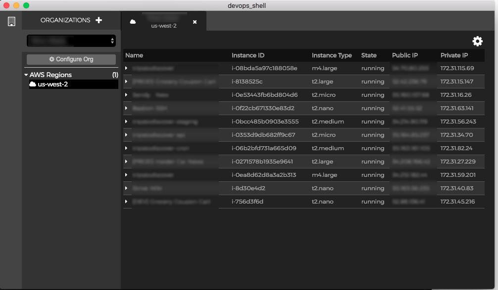

<div align="center">
<br />

<br />
<a href="http://ricktbaker.com/opshell">Website</a>
<br>
<br>
</div>

This is my current pet project which is meant to help those that work with a number of AWS accounts.   Always having to login to the console to find the server you want to connect to, if you need to use a bastion host, what key you need to use, etc.

This is still very early in the development phase.   It has some rough edges for sure, so if you have any problems just open up an Issue.   You can either download one of the prebuilt packages, or you can clone the repo and run it directly with npm.

Primary Components:

- Electron
- Vue
- XTerm.js
- node-pty
- Amazon SDK

#### Changelog

[View the Current ChangeLog](CHANGELOG.md)

#### Downloads - Version 0.0.10

[Mac](http://opshell.ricktbaker.com/opshell-0.0.10.dmg)

[Windows](http://opshell.ricktbaker.com/opshell-Setup-0.0.10.exe) (Requires OpenSSH to be installed and ssh.exe to be in PATH)

Linux Package coming soon

#### Clone Repo and Build Setup for Mac/Linux
``` bash
# install dependencies and native modules
./do_install.sh

# serve with hot reload at localhost:9080
npm run dev

# build electron application for production
npm run build
```

#### Clone Repo and Build Setup for Windows

Note: you'll need to have OpenSSH installed and ssh.exe in your path

``` bash
# install dependencies
yarn

# serve with hot reload at localhost:9080
yarn run dev

# build electron application for production
yarn run build
```

#### What is working thus far

Setup multipe organizations


Add your AWS access keys per Organization and region (only needs ec2.describeInstances currently)


Scan for keys that are used for SSH access, and import them.   Add custom users as well.



Easily list out instances in regions you have setup



Setup a bastion host per region if you need to ssh into it first to access private ip servers behind


Easily connect via ssh to a server with the click of a button.  If no key has been impored for user it
will fall back to password prompt.


### What's to come

So much more.   Eventually would like to add regular server support, google cloud, etc.

Preferences, colors, styles, etc.

Ability to show more details about servers

Use native ssh2 module instead of relying on node-pty

Too much to list...
